# GitHub Actions CI/CD Plugin

Automated continuous deployment from GitHub to EC2 using GitHub Actions.

## Features

- ✅ Automated builds on push to main branch
- 🚀 Direct deployment to EC2 instances
- 🔒 Secure secret management
- 🔄 Zero-downtime deployments with backup/restore
- 📦 Multi-framework support (Spring Boot, Node.js, React, Next.js, Python)
- 🐳 Docker-based deployment
- 📊 Deployment logs in GitHub Actions

## Supported Frameworks

- **Spring Boot**: Gradle/Maven builds, JAR deployment
- **Node.js**: npm/yarn builds
- **React**: Static site builds, Nginx serving
- **Next.js**: Server-side rendering, optimized builds
- **Python**: FastAPI, Flask, Django

## Prerequisites

- GitHub repository
- EC2 instance with Docker installed
- SSH access to EC2 instance
- ARFNI project deployed to EC2

## Setup via ARFNI GUI

The easiest way to set up CI/CD is through the ARFNI GUI:

1. Deploy your project to EC2 using ARFNI
2. After successful deployment, click "Setup CI/CD" in the success modal
3. Follow the 5-step wizard:
   - **Step 1**: Select GitHub Actions as your platform
   - **Step 2**: Authenticate with GitHub (OAuth or Personal Access Token)
   - **Step 3**: Select your repository
   - **Step 4**: Configure deployment settings (branch, framework, paths)
   - **Step 5**: Review and confirm

The GUI will automatically:
- Generate the appropriate workflow file for your framework
- Commit it to your repository
- Configure GitHub Secrets (EC2_HOST, EC2_USER, EC2_SSH_KEY)

## Manual Setup

If you prefer manual configuration, follow these steps:

### 1. Install Plugin

```bash
arfni plugin install github-actions
```

### 2. Add to stack.yaml

```yaml
services:
  cicd:
    kind: cicd.github-actions
    spec:
      repository_url: "https://github.com/username/repo"
      branch: "main"
      framework: "springboot"
      java_version: "17"
      deploy_root: "/home/ubuntu/arfni-deploy"
      docker_service: "spring"
```

### 3. Configure GitHub Secrets

Go to your GitHub repository → Settings → Secrets and variables → Actions → New repository secret

Add the following secrets:
- `EC2_HOST`: Your EC2 instance IP address
- `EC2_USER`: SSH username (usually `ubuntu`)
- `EC2_SSH_KEY`: Your private SSH key (entire content of your .pem file)

### 4. Push to Repository

The workflow file will be generated in `.github/workflows/deploy.yml`. Commit and push it to your repository.

## Usage

### Automatic Deployment

After setup, every push to your configured branch will automatically:
1. Build your application
2. Package it (JAR/Docker image/static files)
3. Transfer to EC2
4. Backup previous version
5. Deploy new version
6. Restart services
7. Verify deployment

### Manual Trigger

You can manually trigger deployments from GitHub:
1. Go to your repository's Actions tab
2. Select "Deploy to EC2" workflow
3. Click "Run workflow"
4. Select branch and run

## Framework-Specific Details

### Spring Boot

- Uses Gradle to build JAR file
- Supports Java 11, 17, and 21
- Automatically backs up previous JAR before deployment
- Keeps last 5 backups
- Restarts Docker Compose service

**Build Command**: `./gradlew clean bootJar --no-daemon`

### Node.js

- Runs `npm ci` for clean install
- Runs `npm run build` to build
- Archives dist/build folder
- Extracts on EC2 and runs via Docker

**Build Command**: `npm run build`

### React

- Creates production build via `npm run build`
- Serves via Nginx in Docker container
- Optimized static file serving

**Build Command**: `npm run build`

### Next.js

- Full Next.js build with `.next` folder
- Installs production dependencies on EC2
- Supports SSR and static export

**Build Command**: `npm run build`

### Python

- Supports FastAPI, Flask, Django
- Installs dependencies from requirements.txt
- Excludes virtual environment and cache files from deployment

**Build Command**: `pip install -r requirements.txt`

## Deployment Flow

```mermaid
graph LR
    A[Push to GitHub] --> B[GitHub Actions Triggered]
    B --> C[Build Application]
    C --> D[Run Tests]
    D --> E[Package Artifact]
    E --> F[Transfer to EC2]
    F --> G[Backup Current Version]
    G --> H[Deploy New Version]
    H --> I[Restart Services]
    I --> J[Verify Deployment]
```



## Troubleshooting

### Workflow fails with "Permission denied"
- Check that `EC2_SSH_KEY` secret is set correctly
- Verify SSH key has no passphrase
- Ensure EC2 security group allows SSH from GitHub IPs (0.0.0.0/0 or GitHub's IP ranges)

### Docker commands fail
- Verify Docker is installed on EC2: `docker --version`
- Check user has sudo access
- Ensure docker-compose is installed: `docker compose version`

### Build fails
- Check framework version matches (Java 17, Node 20, etc.)
- Verify all dependencies are available
- Review build logs in GitHub Actions tab

### Service doesn't start
- Check Docker Compose file syntax
- Verify service name matches configuration
- Review container logs: `docker logs <container_name>`

### Files not found on EC2
- Verify `DEPLOY_ROOT` path exists
- Check SSH user has write permissions
- Ensure directory structure is created

## Advanced Configuration

### Custom Build Commands

Edit the generated `.github/workflows/deploy.yml` file to customize build commands:

```yaml
- name: Build Spring Boot JAR
  run: ./gradlew clean bootJar --no-daemon -Pprofile=production
```

### Multiple Environments

Create separate workflows for staging/production:

```yaml
# .github/workflows/deploy-staging.yml
on:
  push:
    branches: ["develop"]

env:
  DEPLOY_ROOT: "/home/ubuntu/staging"
```

Use different secrets for each environment:
- `STAGING_EC2_HOST`
- `PRODUCTION_EC2_HOST`

### Environment Variables

Add environment variables to your workflow:

```yaml
env:
  DATABASE_URL: ${{ secrets.DATABASE_URL }}
  API_KEY: ${{ secrets.API_KEY }}
```

### Notifications

Add Slack/Discord notifications:

```yaml
- name: Notify on success
  if: success()
  uses: slackapi/slack-github-action@v1
  with:
    webhook-url: ${{ secrets.SLACK_WEBHOOK }}
    payload: |
      {
        "text": "✅ Deployment successful!"
      }

- name: Notify on failure
  if: failure()
  uses: slackapi/slack-github-action@v1
  with:
    webhook-url: ${{ secrets.SLACK_WEBHOOK }}
    payload: |
      {
        "text": "❌ Deployment failed!"
      }
```

### Health Checks

Add health check after deployment:

```yaml
- name: Health check
  run: |
    sleep 10
    curl -f http://${{ secrets.EC2_HOST }}:8080/health || exit 1
```

### Rollback on Failure

The workflow automatically keeps backups. To manually rollback:

```bash
ssh ubuntu@your-ec2-ip
cd /home/ubuntu/arfni-deploy/apps/backups
ls -lh  # Find the backup you want
cd /home/ubuntu/arfni-deploy/apps
cp backups/app-YYYYMMDD-HHMMSS.jar app.jar
sudo docker compose restart spring
```

## Security Best Practices

1. **Use SSH Keys**: Never commit SSH keys to repository
2. **GitHub Secrets**: Always use secrets for sensitive data
3. **Minimal Permissions**: Grant only necessary permissions to GitHub tokens
4. **Regular Updates**: Keep GitHub Actions and dependencies up to date
5. **Review Logs**: Regularly check deployment logs for anomalies

## Performance Tips

1. **Caching**: Use GitHub Actions cache for dependencies
2. **Parallel Jobs**: Split build and test into parallel jobs
3. **Incremental Builds**: Use Gradle/npm cache
4. **Docker Layer Caching**: Optimize Dockerfile for layer caching

## Support

- Issues: [GitHub Issues](https://github.com/Arfni/arfni-plugins/issues)
- Documentation: [ARFNI Docs](https://docs.arfni.dev)
- Community: [Discord](https://discord.gg/arfni)

## License

MIT License - see LICENSE file for details

## Changelog

See [CHANGELOG.md](CHANGELOG.md) for version history and changes.

## Contributing

Contributions are welcome! Please read our contributing guidelines and submit pull requests to our repository.

## Related Plugins

- **GitLab CI Plugin**: Coming soon
- **Jenkins Plugin**: Coming soon
- **AWS CodePipeline Plugin**: Planned
