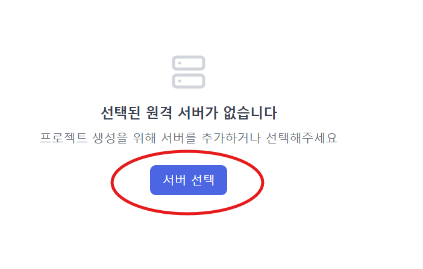
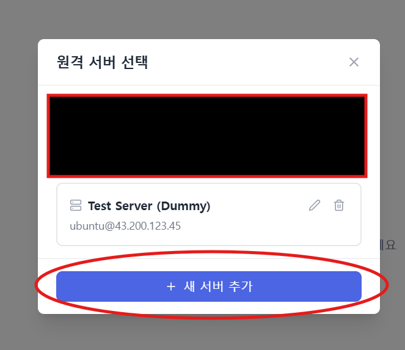
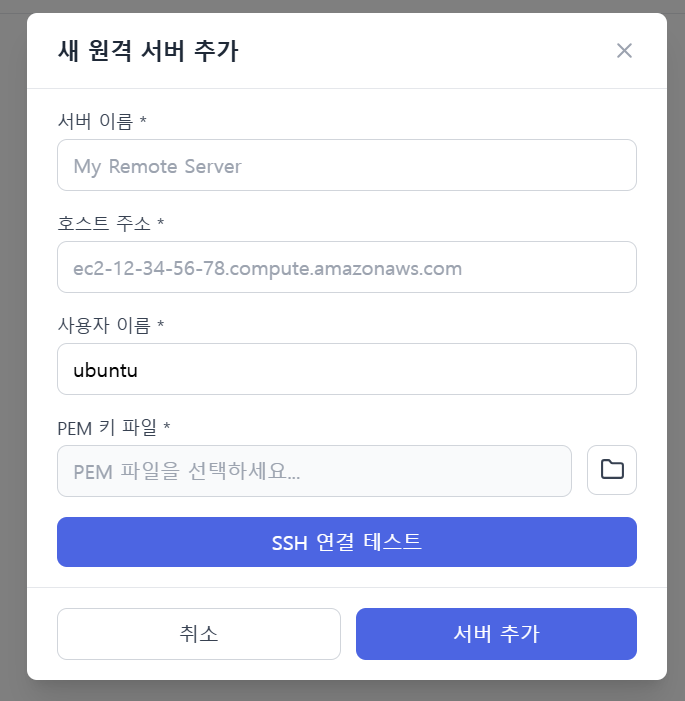
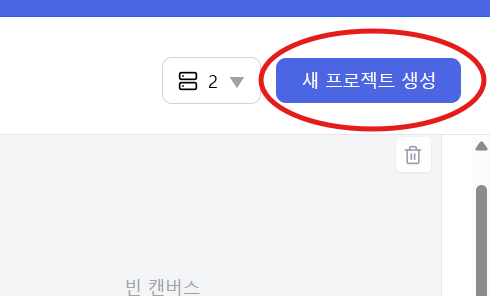
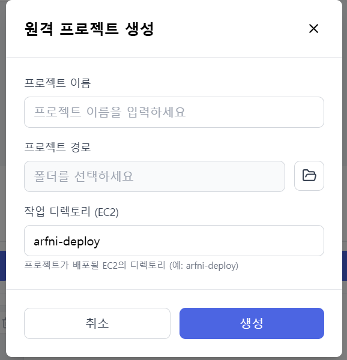
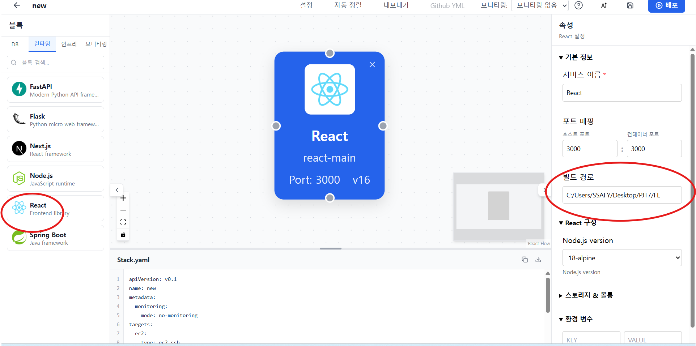
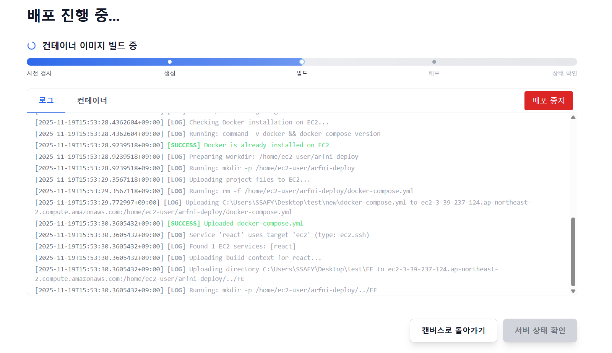
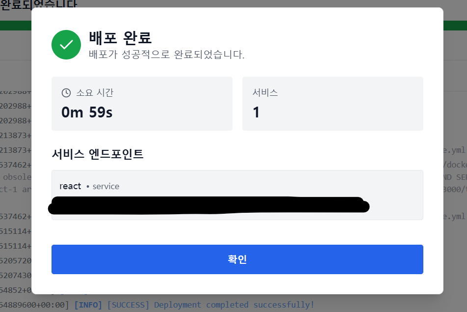

## 1. **exe 파일 설치 방법 Installation**
[다운로드 페이지로 이동](https://arfni.duckdns.org/)
위 페이지에서 다운로드 하거나 현재 exec 폴더에 있는 Setup.exe를 다운받아서 실행키면 된다.

설치 가이드
- [📘 한국어 문서 보기](/Docs/DEPLOYMENT_REFERENCE_GUIDE_KO.md)
- [📘 English Docs](/Docs/DEPLOYMENT_REFERENCE_GUIDE.md)

## 2. **랜딩페이지 배포**

FE 폴더에 있는 프로젝트가 랜딩페이지로 이걸 빌드하여 배포할 수 있다.

우리프로젝트의 랜딩페이지는 저희들이 만든 Arfni를 이용하여 배포하였습니다.

그렇기에 아래의 배포 과정들 또한 Arfni를 이용한 배포 가이드 입니다.

1.exe를 실행

2.사이드의 원격 메뉴를 클릭하여 ec2 서버를 추가한다.

3.ec2 서버 추가

4.새로운 프로젝트 생성
오른쪽 상단에 새로운 프로젝트 생성 버튼 클릭

5.프로젝트 정보 입력

프로젝트 경로는 어디에 프로젝트를 만들건지 정한는 주소로 빈 폴더가 필요
작업디렉토리는 ec2에 프로젝트를 올릴 폴더를 정하는 값

6.캔버스 화면에 프로젝트 경로와 프레임워크 선택

왼쪽 사이드에 우리가 배포하고자 하는 프레임워크 선택 => 리액트
캔버스 위에 올라간 리액트 이미지를 클릭후 오른쪽 사이드에 배포하고자 하는 리애특 프로젝트 경로를 빌드 경로에 작성
(경로를 작성할때는 현재 프로젝트 경로에서의 상대 경로로 작성해야한다. 또는 어려운 경우 프로젝트 안에 apps/react 폴더를 만들어서 그안에 프로젝트 파일들을 넣어둔다.)
그후 맨 오른쪽 상단에 **배포** 버튼을 클릭

7.배포

이렇게 되면 배포가 완료되고 서비스 엔드포인트 아래 작힌 주소를 클릭하면 배포된 서비스로 이동이 가능하다.
